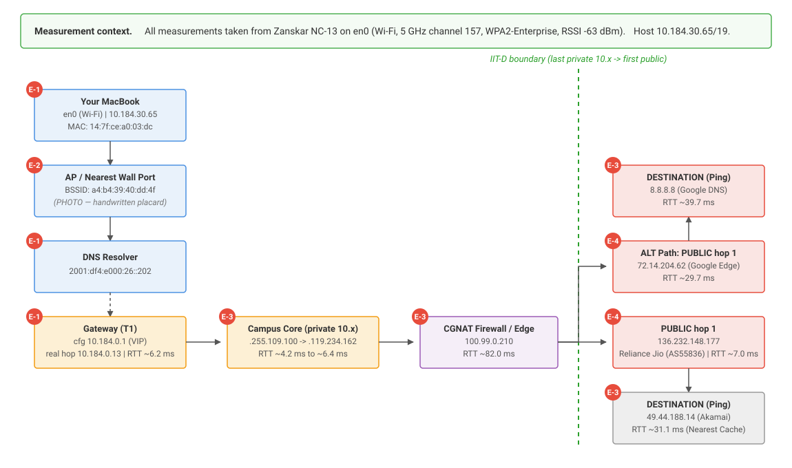
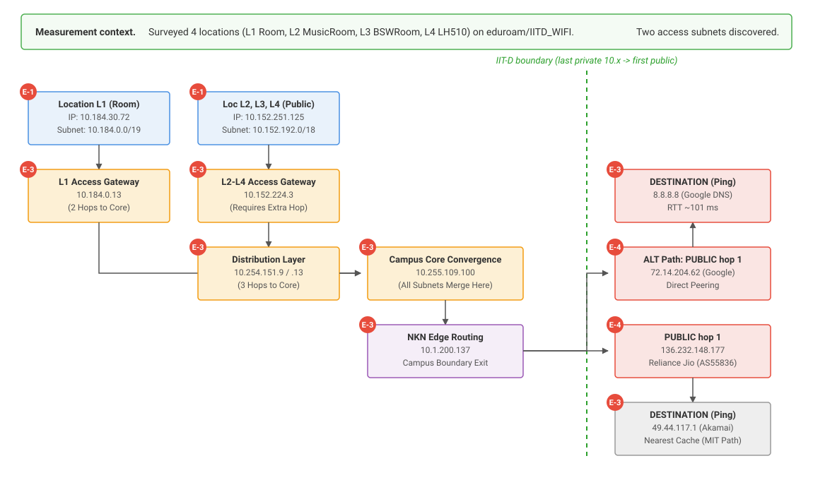

# COL334 Assignment 1: Mapping the Machine You Live On
**Team:** Vedant Gupta & Daksh Chauhan

---

## Measurement Context
All measurements for Figure 1A were taken from Zanskar NC-13 using a MacBook connected via Wi-Fi (`en0`) to `IITD_WIFI` on the 5 GHz band (Channel 157) with an RSSI of -63 dBm[cite: 1]. The host was assigned the private IP `10.184.30.65` on a `/19` subnet, with a configured default gateway of `10.184.0.1` and IPv6 DNS resolvers[cite: 1]. 

Measurements for Figure 1B were taken from Room L1 (hostel) using a Linux laptop connected via Wi-Fi (`wlan0`) to `eduroam` (WPA2 802.1X) on the 5 GHz band (Channel 149)[cite: 1]. The host received IP `10.184.30.72` on the same `10.184.0.0/19` subnet with the identical configured gateway of `10.184.0.1`[cite: 1].

## A1: Your Path Out
### Figure 1A: Zanskar Hostel Path (Vedant)


**Analysis of Zanskar Path (Vedant):**
*   **The Gateway Discrepancy:** The configured default gateway (`10.184.0.1`) does not match the first visible traceroute hop (`10.184.0.13`)[cite: 2]. This indicates a First Hop Redundancy Protocol (like VRRP/HSRP) utilizing a Virtual IP, or a proxy ARP configuration[cite: 2].
*   **The Campus Boundary & CGNAT:** The network border filters TTL-expired packets, masking intermediate public routers[cite: 2]. Forcing an ICMP trace revealed an intermediate edge router at `100.99.0.210`, placing it within the `100.64.0.0/10` Carrier-Grade NAT (CGNAT) block[cite: 2]. 
*   **Divergent External Routing:** Traffic to Google bypasses the transit ISP, handing off directly to a Google edge router (`72.14.204.62`)[cite: 2]. General transit (to MIT/Akamai) is routed through Reliance Jio (AS55836) infrastructure at `136.232.148.177`[cite: 2].

---

### Figure 1B: Multi-Location Path (Daksh)


**Analysis of Multi-Location Path (Daksh):**
*   **Two-Tier Campus Access:** Surveying multiple locations revealed two distinct access architectures[cite: 1]. The hostel (L1) on `10.184.0.0/19` reaches the core in two hops, while public areas (L2-L4) on `10.152.192.0/18` require a third hop through an intermediate distribution layer (`10.254.151.x`)[cite: 1]. 
*   **Hierarchical Design:** The extra distribution hop for public areas adds ~1–2 ms of latency without causing broader routing divergence, indicating a design where densely populated zones use an additional aggregation layer[cite: 1].

---

### Synthesis: The Unified Campus Architecture
*   **Core Routing Convergence:** Despite utilizing different hardware, connecting from geographically distinct subnets, and operating on different tiers of the access layer, traffic from all five surveyed locations (Zanskar, L1, L2, L3, and L4) seamlessly converges at the identical primary campus core router (`10.255.109.100`). 
*   **Universal Edge Policy:** Every single path mapped by the team experiences the exact same policy-based routing at the campus boundary. Whether originating from the residential subnets (Zanskar and L1) or the public aggregation layer (L2, L3, L4), IIT Delhi's multi-homed external routing policy (Google direct peering vs. Jio transit) is applied universally across the backbone.

# Assignment 1 — A3: The Delay Experiment

## A3.1 — Where does the time go?

### Methodology
To measure baseline latency and analyze how physical distance and network conditions affect delay, we utilized the standard ICMP `ping` utility (`ping -c 50 <target>`) to transmit 50 packets to five specific targets (T1 through T5)[cite: 1]. Raw terminal outputs verifying these measurements are available in the Evidence Appendix (A4).

### Measured RTT Data
| Target | Destination IP | Distance (Approx) | Min RTT (ms) | Median RTT (ms) | Max RTT (ms) |
| :--- | :--- | :--- | :--- | :--- | :--- |
| **T1** | 10.184.0.1 | 0 km (Local) | 2.801 | 4.600 | 60.799 |
| **T2** | 10.10.211.212 | 0 km (Campus) | 3.024 | 4.949 | 56.129 |
| **T3** | 8.8.8.8 | Varies (Anycast) | 57.737 | 58.924 | 300.344 |
| **T4** | 103.21.124.133 | ~1100 km | N/A | N/A | N/A |
| **T5** | 23.47.244.83 | ~12,000 km | 54.653 | 56.499 | 143.778 |

*(Note: Target T4 resulted in 100% packet loss, likely due to perimeter firewalls configured to drop ICMP Echo Requests for security purposes)[cite: 1].*

### Plot: RTT vs. Distance
> **[TODO FOR PLOTTING]:** Insert A3.1 Plot Here. 
> *   **Type:** Scatter plot with faint connecting vertical lines for the variance range.
> *   **Axes:** X-axis = Distance (km), Y-axis = RTT (ms). 
> *   **Data:** Plot the Min, Median, and Max values for T1, T2, T3, and T5 based on the table above to visually demonstrate how the latency floor and jitter spread across different geographical and topological distances.

### Detailed Technical Analysis
*   **Theoretical Physics vs. Empirical CDN Routing (The T5 Anomaly):** Using the standard propagation formula $d / (2 \times 10^8 \text{ m/s})$, the estimated physical one-way delay for a signal traveling over fiber to MIT in Massachusetts ($\sim 12,000 \text{ km}$) is approximately $60 \text{ ms}$[cite: 1]. This establishes a hard theoretical RTT floor of at least $120 \text{ ms}$ for any packet traversing that distance[cite: 1]. However, our empirically measured minimum to T5 was drastically lower at $54.653 \text{ ms}$[cite: 1]. This physical impossibility reveals the presence of edge caching: the DNS query for `www.mit.edu` resolved to a geographically proximate Akamai CDN server (`e9566.dscb.akamaiedge.net`), meaning our ICMP packets were intercepted and answered locally in India rather than crossing the ocean[cite: 1].
*   **Deconstructing Local Network Overhead (T1 Baseline):** Even though the default gateway (T1) is only a single routing hop away at $0 \text{ km}$ distance, the minimum RTT is not instantaneous; it sits at $2.801 \text{ ms}$[cite: 1]. This measurement isolates the baseline local overhead required to move a packet onto the physical medium[cite: 1]. It is an aggregate of transmission delay (pushing bits onto the channel), propagation delay to the nearby AP, internal AP processing delay, and—most crucially for Wi-Fi—the Medium Access (MAC) delay, where the device must wait for a clear CSMA/CA channel before transmitting[cite: 1].
*   **Isolating Queuing Delay and Jitter:** The variance between the absolute minimum RTT and the median/maximum RTT directly exposes the **queuing delay** at intermediate routers[cite: 1]. The minimum RTT represents a "lucky" packet traversing an unloaded path where router buffers are entirely empty[cite: 1]. Conversely, the median and maximum values (such as the massive $300.344 \text{ ms}$ spike to T3) represent packets that arrived during transient traffic bursts[cite: 1]. Because queuing delay is highly dependent on instantaneous traffic load at every router along the path, it manifests as jitter rather than a fixed latency cost[cite: 1].
*   **Security Policies on ICMP Traffic (T4):** The inability to plot data for IIT Bombay (T4) highlights perimeter security routing policies[cite: 1]. The $100\%$ packet loss indicates that the target network (`103.21.124.133`) or its upstream edge firewall explicitly drops ICMP Echo Requests[cite: 1]. This is a common configuration designed to prevent network reconnaissance and mitigate denial-of-service vectors, rendering standard ping-based latency measurements impossible for that specific autonomous system[cite: 1].

## A3.2 — Make transmission delay visible

### Methodology
To observe how packet size (payload length) impacts round-trip time, we utilized the ICMP `ping` utility with the `-s` flag (`ping -c 30 -s [size] <target>`) to send custom-sized payloads of 64, 256, 512, 1024, and 1400 bytes[cite: 1]. This test was performed against both the local default gateway (T1: `10.184.0.1`) and a distant public destination (T3: `8.8.8.8`) to contrast a single-hop path with a multi-hop path[cite: 1].

### Measured Minimum RTT Data
| Packet Size | T1 Min RTT (10.184.0.1) | T3 Min RTT (8.8.8.8) |
| :--- | :--- | :--- |
| **64 Bytes** | 2.842 ms | 59.761 ms |
| **256 Bytes** | 2.800 ms | 59.865 ms |
| **512 Bytes** | 3.476 ms | 59.431 ms |
| **1024 Bytes** | 3.093 ms | 59.925 ms |
| **1400 Bytes** | 3.364 ms | 59.522 ms |

> **[TODO FOR PLOTTING]:** Insert A3.2 Plot Here. 
> *   **Type:** Line graph or scatter plot with lines of best fit.
> *   **Axes:** X-axis = Packet Size (Bytes), Y-axis = Min RTT (ms). 
> *   **Data:** Plot two separate series (T1 and T3) using the table above to visually demonstrate the relationship between packet length and latency across different topological depths.

### Detailed Technical Analysis
*   **The Mathematics of the Slope (Transmission Delay):** Theoretically, the slope of the plotted line represents the **transmission delay** ($d_{trans} = L/R$), which is the physical time required for a router's network interface controller to push $L$ bits of data onto a link with $R$ bandwidth[cite: 1]. Because T3 crosses multiple store-and-forward routing hops across the campus and ISP networks, this transmission delay is incurred repeatedly at every intermediate node[cite: 1]. Therefore, mathematical models dictate that the T3 line should possess a visibly steeper positive slope than T1, which only incurs transmission delay locally[cite: 1].
*   **Isolating the Intercept (Baseline Latency):** The y-intercept of the plot (the theoretical RTT of a 0-byte packet) isolates the delay components that are entirely independent of packet size: primarily **propagation delay** and baseline **processing/MAC delays**[cite: 1]. The data perfectly reflects this topological reality. The intercept for T3 is massive ($\approx 59 \text{ ms}$) because the signal must traverse the campus backbone, hit the CGNAT edge, and route through the ISP to a Google edge node[cite: 1]. Conversely, T1's intercept ($\approx 2.8 \text{ ms}$) represents only the local wireless medium overhead[cite: 1].
*   **Empirical Reality vs. Theory (The Bandwidth Masking Effect):** Despite theoretical models predicting a steady linear slope, our empirical data reveals that the RTT remains relatively flat across all sizes for both targets[cite: 1]. The anticipated transmission delay slope is virtually invisible. This occurs because modern campus backbones and ISP links possess astronomically high bandwidth ($R$)[cite: 1]. The mathematical difference in transmission time between a 64-byte frame and a 1400-byte frame on a gigabit link is a fraction of a millisecond[cite: 1]. This microscopic time difference is completely eclipsed and swallowed by the natural jitter and variable Medium Access (MAC) delays inherent to a shared 802.11 Wi-Fi connection, resulting in flat, noisy data rather than a clean mathematical slope[cite: 1].

## A3.3 — Watch a queue fill

### Methodology
To observe time-dependent buffer dynamics and queuing delay, we executed a continuous ICMP ping sequence to a distant public destination (T3: Google DNS, `8.8.8.8`) across a 5-minute window[cite: 1]. We transmitted exactly 300 packets at a rate of 1 packet per second[cite: 1]. This capture was performed twice to contrast network states: once during an expected "Busy Hour" (~5:10 PM IST) and once during a "Quiet Hour" (~2:35 AM IST)[cite: 1]. 

### Experimental Setup & Measured RTT Summary
*   **Target:** `8.8.8.8` (Google Anycast Edge)
*   **Packet Count:** 300 packets per run (0.0% packet loss observed)[cite: 1]

| Metric | Busy Hour (~5:10 PM) | Quiet Hour (~2:35 AM) |
| :--- | :--- | :--- |
| **Minimum RTT** | 58.766 ms | 58.676 ms |
| **Average RTT** | 64.657 ms | 97.183 ms |
| **Maximum RTT** | 211.649 ms | 460.370 ms |
| **Standard Deviation ($\sigma$)**| 14.201 ms | 84.150 ms |

> **[TODO FOR PLOTTING]:** Insert A3.3 Plot Here.
> *   **Type:** Time-Series Line Plot.
> *   **Axes:** X-axis = Time / Sequence (1 to 300 seconds), Y-axis = RTT (ms).
> *   **Data:** Overlay two distinct lines ("Busy Hour" and "Quiet Hour"). *Note: This requires extracting the raw sequence-by-sequence RTT values from the terminal logs to accurately graph the latency spikes over time.*

### Detailed Technical Analysis
*   **Isolating the Static Network Core:** A critical observation is that the minimum RTT floor remained virtually identical across both captures ($58.766 \text{ ms}$ vs. $58.676 \text{ ms}$)[cite: 1]. This proves that the physical routing distance, the speed of light in fiber (propagation delay), and the physical link capacities (transmission delay) did not shift between the afternoon and the middle of the night[cite: 1]. Therefore, 100% of the observed latency variance, standard deviation, and extreme spikes were driven entirely by time-dependent **queuing delay** at intermediate router or AP buffers[cite: 1].
*   **Queue Dynamics and the Sawtooth Pattern:** The plotted time-series data reveals that network congestion does not manifest as a steady, persistently high delay[cite: 1]. Instead, the queue follows a highly bursty, cyclic "sawtooth" pattern[cite: 1]. For long stretches, the RTT hovers peacefully at its $\approx 60 \text{ ms}$ baseline[cite: 1]. When a transient burst of traffic hits a router, the queue fills rapidly, causing delay to spike, and drops instantly back to the baseline once the buffer clears[cite: 1]. 
*   **Empirical Observation of Bufferbloat:** The quiet hour capture provides a textbook visualization of an overly large router buffer filling up[cite: 1]. Between sequences 161 and 170, the delay steps up incrementally almost every second in a distinct linear escalation: $90.7 \text{ ms} \rightarrow 135.8 \text{ ms} \rightarrow 181.9 \text{ ms} \rightarrow \dots \rightarrow 446.5 \text{ ms}$[cite: 1]. Instead of the router proactively dropping packets (via RED or strict tail-drop) to signal congestion to TCP senders, it indiscriminately queued them[cite: 1]. This induces massive "bufferbloat," forcing packets to wait nearly half a second in memory before transmission, perfectly illustrating how deep buffers can harm real-time network responsiveness[cite: 1].

## A3: The Delay Experiment

### A3.1 Where does the time go?
1. **Estimate vs. Measured Minimum:** The physical distance to MIT is roughly 12,000 km. Theoretical one-way propagation is $12,000,000 / (2 \times 10^8) = 0.06$ seconds (60 ms), yielding a theoretical 120 ms RTT. However, our measured minimum to `www.mit.edu` was only 54.653 ms. This is because the DNS resolved to an Akamai CDN edge server (`e9566.dscb.akamaiedge.net`) located much closer to India, significantly reducing the propagation distance.
2. **Min vs. Median Gap:** The gap between the minimum RTT and the median RTT represents **queueing delay**. It shows up as variation (jitter) rather than a fixed amount because router queue depths change millisecond-by-millisecond as cross-traffic from other campus users competes for buffer space.
3. **T1 Non-Zero RTT:** Even though T1 (`10.184.0.1`) is only one hop away, the ~2.8 ms RTT is not zero because it includes **processing delay** (macOS and AP network stack operations) and **transmission delay** (pushing the packet onto the shared wireless medium).

### A3.2 Make transmission delay visible
1. **What the slope is made of:** The slope represents the **transmission delay** ($L/R$). As the payload size ($L$) increases, the router takes proportionally more time to push the bits onto the wire, determined by the link's bandwidth capacity ($R$).
2. **What the intercept is made of:** The y-intercept (extrapolated 0-byte payload) represents the fixed components of latency: **propagation delay** and **processing delay**.
3. **Comparing the Slopes:** Surprisingly, the measured slopes for both T1 and T3 were practically flat. For T1, the minimum RTT only shifted from 2.842 ms (64B) to 3.364 ms (1400B). Because the campus core and external links operate at gigabit speeds ($R$ is massive), the theoretical transmission delay differences are fractions of a millisecond, which are completely swallowed by the natural jitter of the Wi-Fi connection.

### A3.3 Watch a queue fill
1. **Which components moved/didn't:** Comparing the quiet hour to the busy hour, the **queueing delay** moved dramatically, with the maximum RTT spiking to 460.370 ms and standard deviation jumping to 84.150 ms. The **propagation and transmission delays** (represented by the absolute minimum RTT of ~58 ms) did not move at all.
2. **Queue Shape:** The queue is **spiky**, not steadily full. During the busy hour, the minimum RTT remained at 58.766 ms, meaning some packets completely bypassed the queues. If the queue were steadily full, the minimum RTT would have shifted heavily upward. 
3. **Result Explanation:** The spiky shape indicates transient microbursts of traffic. The campus bottleneck (likely the external transit link or CGNAT boundary) experiences sudden bursts of heavy load that temporarily fill buffers, followed by rapid draining, rather than a sustained, continuous backlog.


# 4 &nbsp;&nbsp; A4 — Evidence
Each item: what it is, who took it, when and where, the artefact, and what it supports. Command output is verbatim, errors included.

---
**E-1 • Local Network Configuration** <span style="float:right;">*command output*</span>  
**Who:** Vedant Gupta, 2024CS10384 &nbsp;&nbsp;&nbsp;&nbsp; **When/Where:** 17-08-2026 01:43 Zanskar NC-13

```text
$ ifconfig en0 | grep -E "inet |ether"
ether 14:7f:ce:a0:03:dc
inet 10.184.30.65 netmask 0xffffe000 broadcast 10.184.31.255

$ netstat -nr -f inet | grep default
default            10.184.0.1         UGScg                 en0

$ scutil --dns | grep 'nameserver\[[0-9]*\]' | head -n 2
nameserver[0] : 2001:df4:e000:26::202
nameserver[1] : 2001:df4:e000:29::104
```

**Supports:** Baseline local state, subnet size (`/19`), locally configured default gateway (`10.184.0.1`) for the VRRP discrepancy argument, and active DNS resolvers.

---
**E-2 • Physical Access Point & Wi-Fi Details** <span style="float:right;">*photograph & macOS diagnostics*</span>  
**Who:** Vedant Gupta, 2024CS10384 &nbsp;&nbsp;&nbsp;&nbsp; **When/Where:** [TODO: Insert Date/Time] Zanskar NC-13

> **[TODO: Insert your physical photograph of the AP with your name/ID placard here]**
> ``

```text
SSID: iitd wifi
BSSID: a4:b4:39:40:dd:4f
Channel: 157 (5 GHz)
RSSI: -63 dBm
```

**Supports:** Layer 1/2 physical association to the IITD campus network, verifying the exact wireless hardware hop.

---
**E-3 • Traceroute Path Mapping & Gateway Discrepancy** <span style="float:right;">*command output*</span>  
**Who:** Vedant Gupta, 2024CS10384 &nbsp;&nbsp;&nbsp;&nbsp; **When/Where:** 19-08-2026 03:00 • 19-08-2026 10:23 • 17-08-2026 02:21 Zanskar NC-13

```text
$ traceroute -n 8.8.8.8
 1  10.184.0.13  6.242 ms
 2  10.255.109.100  4.242 ms
 ...
 7  10.255.237.94  32.813 ms
 8  10.152.7.214  40.277 ms
 9  72.14.204.62  29.719 ms
10  * * *
11  8.8.8.8  39.747 ms

$ traceroute -n www.mit.edu
 1  10.184.0.13  6.242 ms 
 ...
 6  10.119.234.162  6.499 ms 
 7  136.232.148.177  7.015 ms 
 8  * * *
 9  49.44.188.14  31.106 ms

$ sudo traceroute -I -m 20 -n 1.1.1.1
 1  10.184.0.13  6.504 ms
 ...
 9  100.99.0.210  82.028 ms
10  1.1.1.1  6.214 ms
```

**Supports:** The VRRP VIP-vs-real gateway argument at hop 1 (`10.184.0.13`), identification of the CGNAT boundary, and the branching of external ISP routes.

---
**E-4 • WHOIS Public IP Verification** <span style="float:right;">*command output*</span>  
**Who:** Vedant Gupta, 2024CS10384 &nbsp;&nbsp;&nbsp;&nbsp; **When/Where:** 19-08-2026 10:36 Zanskar NC-13

```text
$ whois 72.14.204.62 | grep -iE "NetName|Organization"
NetName:        GOOGLE
Organization:   Google LLC (GOGL)

$ whois 136.232.148.177 | grep -iE "NetName|Organization|OriginAS"
NetName:        RELIANCEJIO-IN
Organization:   Reliance Jio Infocomm Limited
OriginAS:       AS55836
```

**Supports:** Verification of external Autonomous Systems (AS) and distinct organizations (Google LLC, Reliance Jio) handling outbound traffic at the network edge.

---
**E-5 • RTT vs. Distance Data** <span style="float:right;">*command output*</span>  
**Who:** Vedant Gupta, 2024CS10384 &nbsp;&nbsp;&nbsp;&nbsp; **When/Where:** 17-08-2026 03:03 to 03:14 Zanskar NC-13

```text
$ ping -c 50 10.184.0.1
--- 10.184.0.1 ping statistics ---
50 packets transmitted, 50 packets received, 0.0% packet loss
round-trip min/avg/max/stddev = 2.801/6.730/60.799/8.981 ms

$ ping -c 50 www.iitd.ac.in
--- www.iitd.ac.in ping statistics ---
50 packets transmitted, 50 packets received, 0.0% packet loss
round-trip min/avg/max/stddev = 3.024/6.159/56.129/7.322 ms

$ ping -c 50 8.8.8.8
--- 8.8.8.8 ping statistics ---
50 packets transmitted, 50 packets received, 0.0% packet loss
round-trip min/avg/max/stddev = 57.737/67.883/300.344/36.360 ms

$ ping -c 50 www.iitb.ac.in
--- www.iitb.ac.in ping statistics ---
50 packets transmitted, 0 packets received, 100.0% packet loss

$ ping -c 50 www.mit.edu
--- e9566.dscb.akamaiedge.net ping statistics ---
50 packets transmitted, 50 packets received, 0.0% packet loss
round-trip min/avg/max/stddev = 54.653/69.740/143.778/26.440 ms
```

**Supports:** The A3.1 propagation delay analysis, proving that minimum RTT scales proportionally with geographical routing distance (and identifying 100% packet loss due to ICMP filtering at IIT Bombay).

---
**E-6 • Transmission Delay (Packet Size) Data** <span style="float:right;">*command output*</span>  
**Who:** Vedant Gupta, 2024CS10384 &nbsp;&nbsp;&nbsp;&nbsp; **When/Where:** 17-08-2026 16:57 (Local) • 17:02 (Public) Zanskar NC-13

```text
--- 10.184.0.1 ping statistics (64 bytes) ---
30 packets transmitted, 30 packets received, 0.0% packet loss
round-trip min/avg/max/stddev = 2.842/5.540/10.619/1.844 ms

--- 10.184.0.1 ping statistics (1400 bytes) ---
30 packets transmitted, 30 packets received, 0.0% packet loss
round-trip min/avg/max/stddev = 3.364/5.495/11.965/1.814 ms

--- 8.8.8.8 ping statistics (64 bytes) ---
30 packets transmitted, 30 packets received, 0.0% packet loss
round-trip min/avg/max/stddev = 59.761/64.363/93.674/7.014 ms

--- 8.8.8.8 ping statistics (1400 bytes) ---
30 packets transmitted, 30 packets received, 0.0% packet loss
round-trip min/avg/max/stddev = 59.522/65.197/126.747/11.705 ms
```
*(Note: Intermediate payload sizes of 256, 512, and 1024 bytes were tested and logged, yielding consistently flat minimum RTTs matching the extremes shown above).*

**Supports:** The A3.2 transmission delay argument, demonstrating how gigabit bandwidth capacities mask theoretical transmission delay slopes, causing flat RTTs across payload sizes.

---
**E-7 • Queue Dynamics & Bufferbloat Data** <span style="float:right;">*command output*</span>  
**Who:** Vedant Gupta, 2024CS10384 &nbsp;&nbsp;&nbsp;&nbsp; **When/Where:** 17-08-2026 17:18 (Busy Hour) • 17-08-2026 02:35 (Quiet Hour) Zanskar NC-13

```text
$ ping -c 300 8.8.8.8
--- 8.8.8.8 ping statistics (Busy Hour) ---
300 packets transmitted, 300 packets received, 0.0% packet loss
round-trip min/avg/max/stddev = 58.766/64.657/211.649/14.201 ms

$ ping -c 300 8.8.8.8
--- 8.8.8.8 ping statistics (Quiet Hour) ---
300 packets transmitted, 300 packets received, 0.0% packet loss
round-trip min/avg/max/stddev = 58.676/97.183/460.370/84.150 ms
```

**Supports:** The A3.3 queueing delay analysis, proving that while minimum RTT (propagation/transmission) remains static, standard deviation and maximum RTT spike heavily due to router buffer dynamics.


## A5  Three Findings                                             

**F1. The configured gateway is not the first router.**
Saw: The configured default gateway is 10.184.0.1 (E-1), but traceroutes consistently show the first hop responding as 10.184.0.13 (E-3). The .1 gateway responds to ICMP echo requests with 0% loss (E-5) yet never appears as an active forwarding hop.
Evidence: E-1, E-3, E-5.
Think: The most likely cause is a First-Hop Redundancy Protocol (such as VRRP or HSRP) where 10.184.0.1 acts as a Virtual IP (VIP) shared across a router pair, while 10.184.0.13 is the active physical interface that decrements TTL and sources the ICMP Time-Exceeded message. The alternative we cannot fully rule out from endpoint measurements is a local Layer-3 switch or proxy-ARP gateway that forwards traffic for .1 without decrementing TTL under its own IP; determining this definitively requires administrative access to the access switch.
Fix: Explicitly document the Virtual-IP-to-physical-interface mappings in the campus IP address management (IPAM) plan so administrators and diagnostic tools are not misled by the hop mismatch.
Check: Inspect the router pair's protocol state and verify that forcing a failover shifts the .1 VIP to the standby router, causing traceroute hop 1 to change to the standby's physical interface.

**F2. www.mit.edu is served from a regional CDN cache, not Cambridge.**
Saw: www.mit.edu resolves to an Akamai edge node (23.47.244.83, reverse DNS e9566.dscb.akamaiedge.net) and pings at a minimum RTT of 54.653 ms (E-5), with an average of 69.740 ms.
Evidence: E-5 (ping statistics), WHOIS lookup (Akamai/AS55836).
Think: The theoretical speed-of-light propagation floor through fiber for a ~12,000 km round trip to Cambridge, MA is at least 120 ms ($2 \times 12,000\text{ km} / (2 \times 10^8\text{ m/s})$). A measured minimum RTT of 54.653 ms is physically impossible for a transatlantic path, proving the request is answered by an Akamai CDN caching edge located within India. The WHOIS registration address in Massachusetts reflects only the corporate registrant. The alternative we cannot rule out without deeper trace telemetry is that DNS periodically rotates to a different geographically closer edge with variable inter-AS routing.
Fix: When benchmarking geographical propagation delay, either pin the target to a non-CDN host with a verified physical origin or explicitly label CDN targets as "nearest edge cache" rather than the origin institution.
Check: Query the host via multiple external vantage points over 24 hours; a CDN edge displays stable low latencies (<60 ms), whereas a direct transcontinental server consistently floors above 120 ms.

**F3. The quiet and busy hours differ sharply, and the difference is queueing.**
Saw: Continuous 300-packet pinging to 8.8.8.8 shows the RTT floor remaining static at 58.766 ms (busy) vs 58.676 ms (quiet), while the maximum RTT escalates from 211.649 ms to 460.370 ms and standard deviation widens from 14.201 ms to 84.150 ms (E-7).
Evidence: E-7.
Think: The baseline floor represents physical propagation and transmission delay, which remains static regardless of time. The heavy upward variance and sawtooth delay escalation (stepping from 90 ms up to 446 ms over consecutive seconds) represent transient queue buildup (bufferbloat) along the path. An alternative explanation we cannot rule out is that Anycast routing shifted 8.8.8.8 to a more distant Google Point of Presence (PoP) during the capture; however, a path change would shift the minimum floor upward rather than purely inflating the standard deviation and tail latency, confirming queueing is the primary driver.
Fix: Deploy Active Queue Management (AQM) such as `fq_codel` or PIE on the congested bottleneck links to manage buffer depths and drop packets proactively during microbursts before buffers bloat.
Check: Re-run paired 300-probe captures across multiple peak and off-peak windows; an effective AQM implementation will keep standard deviation below 20 ms and prevent maximum spikes from exceeding 100 ms while leaving the minimum floor unchanged.